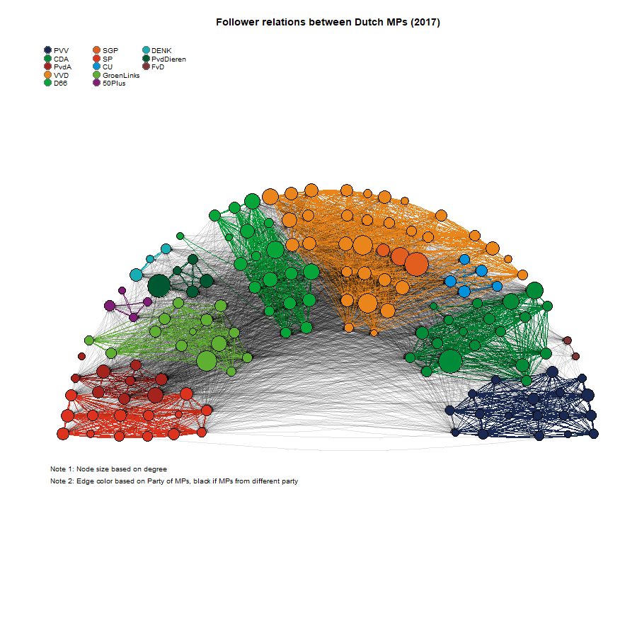
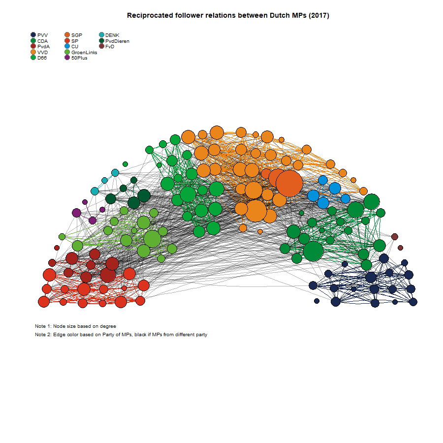
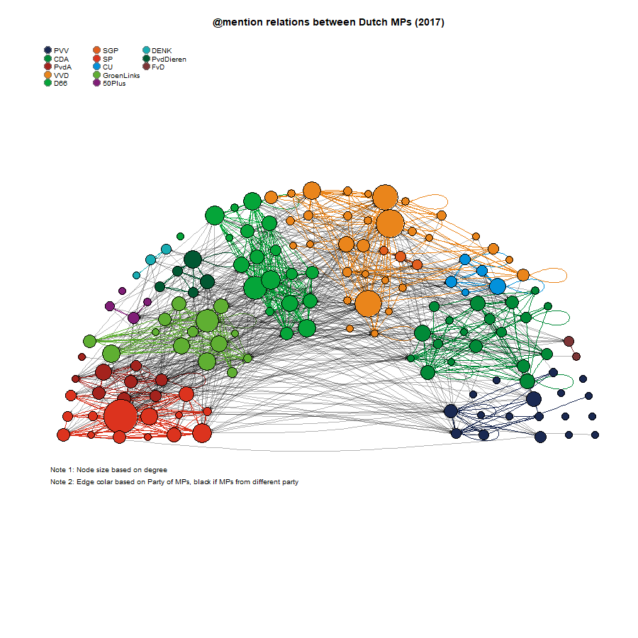
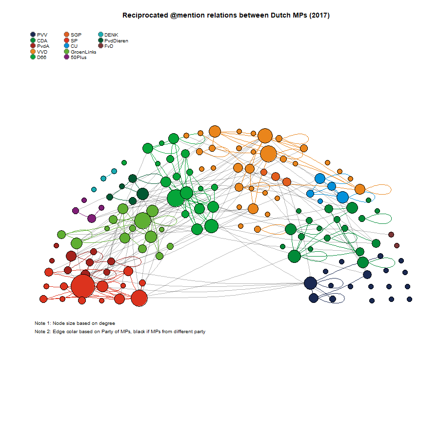
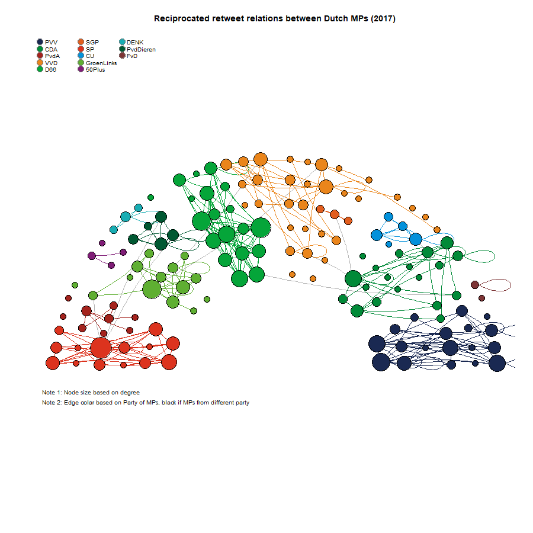

```{r globalsettings, echo=FALSE, warning=FALSE}
library(knitr)
opts_chunk$set(tidy.opts=list(width.cutoff=100),tidy=TRUE, warning = FALSE, message = FALSE,comment = "#>", cache=TRUE, echo=FALSE, class.source=c("test"), class.output=c("test2"))
options(width = 100)
rgl::setupKnitr()
```

```{r colorize, echo=FALSE}
colorize <- function(x, color) {
  if (knitr::is_latex_output()) {
    sprintf("\\textcolor{%s}{%s}", color, x)
  } else if (knitr::is_html_output()) {
    sprintf("<span style='color: %s;'>%s</span>", color, 
            x)
  } else x
}

```

```{r klippy, echo=FALSE, include=TRUE}
klippy::klippy(position = c('top', 'right'))
#klippy::klippy(color = 'darkred')
#klippy::klippy(tooltip_message = 'Click to copy', tooltip_success = 'Done')
```

```{css, echo=FALSE}
pre.test {
  max-height: 300px;
  overflow-y: auto;
  overflow-x: auto;
  margin: 0px;
}

pre.test2 {
  max-height: 300px;
  overflow-y: auto;
  overflow-x: auto;
  margin: 0px;
  background-color: white;
  color: rgb(201, 76, 76);
}


h1, .h1, h2, .h2, h3, .h3 {
  margin-top: 24px;
}


```


------------------------------------------------------------------------

<!---als figuurtjes goed zijn, zet dan eval=FALSE--->


# Intro  


This [website](https://jochemtolsma.github.io/Twitter/) is a replication package for the paper "Twitter" by @Tolsma2021.

It contains R code to replicate all Tables/Figures/Results in the manuscript.

To copy the code click the button in the upper right corner of the code-chunks.

Use the top menu to navigate to the section of interest. 

The source code of this website can be found on [Github](https://github.com/JochemTolsma/Twitter)

Questions can be addressed to [Jochem Tolsma](mailto:jochem.tolsma@ru.nl).

---  

## Packages  

```{r packages, echo=TRUE}
#install if necessary 
if (!require("dplyr", character.only = TRUE)) {install.packages("dplyr", dependencies=TRUE)}
if (!require("foreign", character.only = TRUE)) {install.packages("foreign", dependencies=TRUE)}
if (!require("igraph", character.only = TRUE)) {install.packages("igraph", dependencies=TRUE)}

#load packages.
library(tidyverse)
library(dplyr)
library(foreign)
library(igraph)
library(knitr)
library(kableExtra)

```


---   


## Load data objects {.tabset .tabset-fade}  

See ... for construction of data objects.  

Data objects:  

- key: information on all politicians on election list  
- keyf: information on all 147 MPs with twitter handle  
- mydata: RSiena object with all kind of goodies inside  
- seats: seating coordinates of HoP (used for plotting)

```{r data, echo=TRUE}
#STAP 1: read in data
key <- read.spss('data-processed\\key moederbestand 20171114.sav', use.value.labels=T, to.data.frame=T)


load("data-processed\\twitter_20190919.RData")
#str(twitter_20190919,1)
keyf <- twitter_20190919[[1]]
mydata <- twitter_20190919[[2]]
seats <- twitter_20190919[[3]]

fnet <- mydata$depvars$fnet #following network
atmnet <- mydata$depvars$atmnet #atmention network
rtnet <- mydata$depvars$rtnet #retweet network

fnet1 <- fnet[,,1] #first wave
atmnet1 <- atmnet[,,1] #first wave
rtnet1 <- rtnet[,,1] #first wave

fnet1[fnet1==10] <- 0 #replace missings with 0 for plotting
atmnet1[atmnet1==10] <- 0 #replace missings with 0 for plotting
rtnet1[rtnet1==10] <- 0 #replace missings with 0 for plotting

#define undirected networks of reciprocated ties 
fnet1_un <- fnet1 ==1 & t(fnet1)==1
atmnet1_un <- atmnet1 ==1 & t(atmnet1)==1
rtnet1_un <- rtnet1 ==1 & t(rtnet1)==1

vrouw <- mydata$cCovars$vrouw
partij <- mydata$cCovars$partij
ethminz <- mydata$cCovars$ethminz
lft <- mydata$cCovars$lft

ethminz <- ethminz + attributes(ethminz)$mean
partij <- partij + attributes(partij)$mean
vrouw <- vrouw + attributes(vrouw)$mean
lft <- lft + attributes(lft)$mean


```

---  


## Build plots {.tabset .tabset-fade}

The first step is to make a 'graph object'. 

```{r, echo=TRUE}
#define directed network 
G1d <- graph_from_adjacency_matrix(fnet1, mode = "directed", weighted = NULL, diag = TRUE,  add.colnames = NA, add.rownames = NA)
G2d <- graph_from_adjacency_matrix(atmnet1, mode = "directed", weighted = NULL, diag = TRUE,  add.colnames = NA, add.rownames = NA)
G3d <- graph_from_adjacency_matrix(rtnet1, mode = "directed", weighted = NULL, diag = TRUE,  add.colnames = NA, add.rownames = NA)

#define undirected network 
G1u <- graph_from_adjacency_matrix(fnet1_un, mode = "undirected", weighted = NULL, diag = TRUE,  add.colnames = NA, add.rownames = NA)
G2u <- graph_from_adjacency_matrix(atmnet1_un, mode = "undirected", weighted = NULL, diag = TRUE,  add.colnames = NA, add.rownames = NA)
G3u <- graph_from_adjacency_matrix(rtnet1_un, mode = "undirected", weighted = NULL, diag = TRUE,  add.colnames = NA, add.rownames = NA)

```


### Followers

```{r G1d, echo=TRUE, eval=FALSE}
G1 <- G1d

E(G1)$curved=.1
E(G1)$arrow.size=.1
V(G1)$color <- keyf$Partij_col
V(G1)$size= degree(G1, mode="out")*.1 + 6
V(G1)$label=""

owncoords <- cbind(keyf$X, keyf$Y)
owncoords <- owncoords/8
owncoords[,1] <- (owncoords[,1] - mean(owncoords[,1]))
owncoords[,2] <- (owncoords[,2] - mean(owncoords[,2]))

#change color of edges based on intra or interparty ties
#for transparant black: #0000007D
edges <- get.adjacency(G1)
edges_mat <- matrix(as.numeric(edges), nrow=nrow(edges))
#edges_mat[lower.tri(edges_mat)] <- 0
teller <- 1
coloredges <- NA
for (i in 1:nrow(edges)) {
  for (j in 1:ncol(edges)) {
    if (edges_mat[i,j]==1) {
      if (keyf$Partij_col[i] == keyf$Partij_col[j]) {coloredges[teller] <- keyf$Partij_col[i]}
      if (keyf$Partij_col[i] != keyf$Partij_col[j]) {coloredges[teller] <- "#0000001B"}
      teller <- teller + 1
    }
  }
}
E(G1)$color=coloredges

#prepare a legend
Party_names <- unique(keyf$Partij)
Party_cols <- unique(keyf$Partij_col)

png("MPplotG1d.png",width = 900, height= 900)
{ 
  plot.igraph(G1, mode="directed", layout=owncoords, rescale=F, margin=c(0,0,0,0), xlim=c(min(owncoords[,1]),max(owncoords[,1])),  ylim=c(min(owncoords[,2]),max(owncoords[,2])), main="Follower relations between Dutch MPs (2017)")

legend("topleft", legend=Party_names, pch=21, col="#777777", pt.bg=Party_cols, pt.cex=2, cex=.8, bty="n", ncol=3)

text(-2.2,-1.2, "Note 1: Node size based on degree", adj=0, cex=0.8)
text(-2.2,-1.3, "Note 2: Edge color based on Party of MPs, black if MPs from different party", adj=0, cex=0.8)
}  
dev.off()
 

```

```{r echo=FALSE, out.width='100%'}

```


```{r G1, echo=TRUE, eval=FALSE}
G1 <- G1u

E(G1)$curved=.1

V(G1)$color <- keyf$Partij_col
V(G1)$size= degree(G1)*.3 + 6
V(G1)$label=""

owncoords <- cbind(keyf$X, keyf$Y)
owncoords <- owncoords/8
owncoords[,1] <- (owncoords[,1] - mean(owncoords[,1]))
owncoords[,2] <- (owncoords[,2] - mean(owncoords[,2]))

#change color of edges based on intra or interparty ties
#for transparant black: #0000007D
edges <- get.adjacency(G1)
edges_mat <- matrix(as.numeric(edges), nrow=nrow(edges))
edges_mat[lower.tri(edges_mat)] <- 0
teller <- 1
coloredges <- NA
for (i in 1:nrow(edges)) {
  for (j in 1:ncol(edges)) {
    if (edges_mat[i,j]==1) {
      if (keyf$Partij_col[i] == keyf$Partij_col[j]) {coloredges[teller] <- keyf$Partij_col[i]}
      if (keyf$Partij_col[i] != keyf$Partij_col[j]) {coloredges[teller] <- "#0000004B"}
      teller <- teller + 1
    }
  }
}
E(G1)$color=coloredges

#prepare a legend
Party_names <- unique(keyf$Partij)
Party_cols <- unique(keyf$Partij_col)

png("MPplotG1.png",width = 900, height= 900)
{ 
  plot.igraph(G1, mode="undirected", layout=owncoords, rescale=F, margin=c(0,0,0,0), xlim=c(min(owncoords[,1]),max(owncoords[,1])),  ylim=c(min(owncoords[,2]),max(owncoords[,2])), main="Reciprocated follower relations between Dutch MPs (2017)")

legend("topleft", legend=Party_names, pch=21, col="#777777", pt.bg=Party_cols, pt.cex=2, cex=.8, bty="n", ncol=3)

text(-2.2,-1.2, "Note 1: Node size based on degree", adj=0, cex=0.8)
text(-2.2,-1.3, "Note 2: Edge color based on Party of MPs, black if MPs from different party", adj=0, cex=0.8)
}  
dev.off()
 

```

```{r echo=FALSE, out.width='100%'}

```


---  


### at-mention

```{r, eval=FALSE}

G2 <- G2d

E(G2)$curved=.1
E(G2)$arrow.size=.1
V(G2)$color <- keyf$Partij_col
V(G2)$size= degree(G2, mode="out")*.5 + 6
V(G2)$label=""

owncoords <- cbind(keyf$X, keyf$Y)
owncoords <- owncoords/8
owncoords[,1] <- (owncoords[,1] - mean(owncoords[,1]))
owncoords[,2] <- (owncoords[,2] - mean(owncoords[,2]))

#change color of edges based on intra or interparty ties
edges <- get.adjacency(G2)
edges_mat <- matrix(as.numeric(edges), nrow=nrow(edges))
#edges_mat[lower.tri(edges_mat)] <- 0
teller <- 1
coloredges <- NA
for (i in 1:nrow(edges)) {
  for (j in 1:ncol(edges)) {
    if (edges_mat[i,j]==1) {
      if (keyf$Partij_col[i] == keyf$Partij_col[j]) {coloredges[teller] <- keyf$Partij_col[i]}
      if (keyf$Partij_col[i] != keyf$Partij_col[j]) {coloredges[teller] <- "#0000004B"}
      teller <- teller + 1
    }
  }
}
E(G2)$color=coloredges

#prepare a legend
Party_names <- unique(keyf$Partij)
Party_cols <- unique(keyf$Partij_col)

png("MPplotG2d.png",width = 900, height= 900)
{ 
  plot.igraph(G2, mode="directed", layout=owncoords, rescale=F, margin=c(0,0,0,0), xlim=c(min(owncoords[,1]),max(owncoords[,1])),  ylim=c(min(owncoords[,2]),max(owncoords[,2])), main="@mention relations between Dutch MPs (2017)")

legend("topleft", legend=Party_names, pch=21, col="#777777", pt.bg=Party_cols, pt.cex=2, cex=.8, bty="n", ncol=3)

text(-2.2,-1.2, "Note 1: Node size based on degree", adj=0, cex=0.8)
text(-2.2,-1.3, "Note 2: Edge colar based on Party of MPs, black if MPs from different party", adj=0, cex=0.8)
}  
dev.off()
 

 

```

```{r echo=FALSE, out.width='100%'}

```


```{r G2, echo=TRUE, eval=FALSE}
G2 <- G2u

E(G2)$curved=.1

V(G2)$color <- keyf$Partij_col
V(G2)$size= degree(G2)*1.05 + 6
V(G2)$label=""

owncoords <- cbind(keyf$X, keyf$Y)
owncoords <- owncoords/8
owncoords[,1] <- (owncoords[,1] - mean(owncoords[,1]))
owncoords[,2] <- (owncoords[,2] - mean(owncoords[,2]))

#change color of edges based on intra or interparty ties
edges <- get.adjacency(G2)
edges_mat <- matrix(as.numeric(edges), nrow=nrow(edges))
edges_mat[lower.tri(edges_mat)] <- 0
teller <- 1
coloredges <- NA
for (i in 1:nrow(edges)) {
  for (j in 1:ncol(edges)) {
    if (edges_mat[i,j]==1) {
      if (keyf$Partij_col[i] == keyf$Partij_col[j]) {coloredges[teller] <- keyf$Partij_col[i]}
      if (keyf$Partij_col[i] != keyf$Partij_col[j]) {coloredges[teller] <- "#0000004B"}
      teller <- teller + 1
    }
  }
}
E(G2)$color=coloredges

#prepare a legend
Party_names <- unique(keyf$Partij)
Party_cols <- unique(keyf$Partij_col)

png("MPplotG2u.png",width = 900, height= 900)
{ 
  plot.igraph(G2, mode="undirected", layout=owncoords, rescale=F, margin=c(0,0,0,0), xlim=c(min(owncoords[,1]),max(owncoords[,1])),  ylim=c(min(owncoords[,2]),max(owncoords[,2])), main="Reciprocated @mention relations between Dutch MPs (2017)")

legend("topleft", legend=Party_names, pch=21, col="#777777", pt.bg=Party_cols, pt.cex=2, cex=.8, bty="n", ncol=3)

text(-2.2,-1.2, "Note 1: Node size based on degree", adj=0, cex=0.8)
text(-2.2,-1.3, "Note 2: Edge colar based on Party of MPs, black if MPs from different party", adj=0, cex=0.8)
}  
dev.off()

```


```{r echo=FALSE, out.width='100%'}

```

---  

### retweet


```{r G3d, echo=TRUE, eval=FALSE}
G3 <- G3d

E(G3)$curved=.1
E(G3)$arrow.size=.1

V(G3)$color <- keyf$Partij_col
V(G3)$size= degree(G3, mode="out")*.5 + 6
V(G3)$label=""

owncoords <- cbind(keyf$X, keyf$Y)
owncoords <- owncoords/8
owncoords[,1] <- (owncoords[,1] - mean(owncoords[,1]))
owncoords[,2] <- (owncoords[,2] - mean(owncoords[,2]))

#change color of edges based on intra or interparty ties
edges <- get.adjacency(G3)
edges_mat <- matrix(as.numeric(edges), nrow=nrow(edges))
#edges_mat[lower.tri(edges_mat)] <- 0
teller <- 1
coloredges <- NA
for (i in 1:nrow(edges)) {
  for (j in 1:ncol(edges)) {
    if (edges_mat[i,j]==1) {
      if (keyf$Partij_col[i] == keyf$Partij_col[j]) {coloredges[teller] <- keyf$Partij_col[i]}
      if (keyf$Partij_col[i] != keyf$Partij_col[j]) {coloredges[teller] <- "#0000004B"}
      teller <- teller + 1
    }
  }
}
E(G3)$color=coloredges

#prepare a legend
Party_names <- unique(keyf$Partij)
Party_cols <- unique(keyf$Partij_col)

png("MPplotG3d.png",width = 900, height= 900)
{ 
  plot.igraph(G3, mode="undirected", layout=owncoords, rescale=F, margin=c(0,0,0,0), xlim=c(min(owncoords[,1]),max(owncoords[,1])),  ylim=c(min(owncoords[,2]),max(owncoords[,2])), main="Retweet relations between Dutch MPs (2017)")

legend("topleft", legend=Party_names, pch=21, col="#777777", pt.bg=Party_cols, pt.cex=2, cex=.8, bty="n", ncol=3)

text(-2.2,-1.2, "Note 1: Node size based on degree", adj=0, cex=0.8)
text(-2.2,-1.3, "Note 2: Edge colar based on Party of MPs, black if MPs from different party", adj=0, cex=0.8)
}  
dev.off()
 

```


```{r echo=FALSE, out.width='100%'}
knitr::include_graphics('MPplotG3d.png')
```

```{r G3u, echo=TRUE, eval=FALSE}
G3 <- G3u

E(G3)$curved=.1

V(G3)$color <- keyf$Partij_col
V(G3)$size= degree(G3)*1.05 + 6
V(G3)$label=""

owncoords <- cbind(keyf$X, keyf$Y)
owncoords <- owncoords/8
owncoords[,1] <- (owncoords[,1] - mean(owncoords[,1]))
owncoords[,2] <- (owncoords[,2] - mean(owncoords[,2]))

#change color of edges based on intra or interparty ties
edges <- get.adjacency(G3)
edges_mat <- matrix(as.numeric(edges), nrow=nrow(edges))
edges_mat[lower.tri(edges_mat)] <- 0
teller <- 1
coloredges <- NA
for (i in 1:nrow(edges)) {
  for (j in 1:ncol(edges)) {
    if (edges_mat[i,j]==1) {
      if (keyf$Partij_col[i] == keyf$Partij_col[j]) {coloredges[teller] <- keyf$Partij_col[i]}
      if (keyf$Partij_col[i] != keyf$Partij_col[j]) {coloredges[teller] <- "#0000004B"}
      teller <- teller + 1
    }
  }
}
E(G3)$color=coloredges

#prepare a legend
Party_names <- unique(keyf$Partij)
Party_cols <- unique(keyf$Partij_col)

png("MPplotG3u.png",width = 900, height= 900)
{ 
  plot.igraph(G3, mode="undirected", layout=owncoords, rescale=F, margin=c(0,0,0,0), xlim=c(min(owncoords[,1]),max(owncoords[,1])),  ylim=c(min(owncoords[,2]),max(owncoords[,2])), main="Reciprocated retweet relations between Dutch MPs (2017)")

legend("topleft", legend=Party_names, pch=21, col="#777777", pt.bg=Party_cols, pt.cex=2, cex=.8, bty="n", ncol=3)

text(-2.2,-1.2, "Note 1: Node size based on degree", adj=0, cex=0.8)
text(-2.2,-1.3, "Note 2: Edge colar based on Party of MPs, black if MPs from different party", adj=0, cex=0.8)
}  
dev.off()
 

```


```{r echo=FALSE, out.width='100%'}

```

---  

## Rank orders and description  

```{r}

#most follower outdegrees
G1 <- G1d
foutdegree <- degree(G1, mode="out")
keyf$Partij[which(foutdegree==max(foutdegree))]
keyf$Naam[which(foutdegree==max(foutdegree))]

#most atmention outdegrees
G2 <- G2d
atmdegree <- degree(G2, mode="out")
keyf$Partij[which(atmdegree==max(atmdegree))]
keyf$Naam[which(atmdegree==max(atmdegree))]

#most retweet outdegrees
G3 <- G3d
rtdegree <- degree(G3, mode="out")
keyf$Partij[which(rtdegree==max(rtdegree))]
keyf$Naam[which(rtdegree==max(rtdegree))]

cor.test(foutdegree, atmdegree, method="spearman")
cor.test(foutdegree, rtdegree, method="spearman")
cor.test(rtdegree, atmdegree, method="spearman")

```

Plotjes voor outdegree distribution

try to combine the three deps in one graph and then combine also outdegree and indegree. 

https://www.r-graph-gallery.com/135-stacked-density-graph.html
https://www.r-graph-gallery.com/density_mirror_ggplot2.html


```{r}

```

